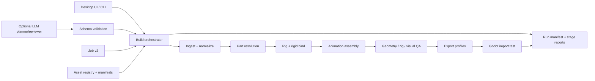

# Voxel Character Factory Implementation Plan

Status: Phases 0-6 implemented; Phase 7 proposed
Planning baseline: 2026-07-28
Primary milestone: achieved — one real, editable, rigged, animated, Godot-tested voxel character builds without opening Blender interactively

## 1. Outcome and scope

The next release is a vertical slice, not a broad feature release. It must prove this path end to end:

1. Load a versioned character job and asset manifests.
2. Import or assemble real voxel body, clothing, hair, and weapon geometry.
3. Preserve scene transforms, palette data, part identity, and origins.
4. Resolve every required semantic body part, reporting ambiguous parts instead of guessing silently.
5. Create a fitted humanoid rig and rigid-bind the voxel parts.
6. Attach and align a heavy sword through declared sockets.
7. Apply a small production animation set.
8. Run geometry, rig, animation, and export validation.
9. Export a correctly scaled GLB and import it into an automated Godot test scene.
10. Produce previews, a machine-readable build report, and recoverable intermediate artifacts.

The public acceptance fixture will be an original **Heavy Sword Hero**. Its proportions exercise the same pipeline as Cloud without requiring copyrighted artwork, ripped assets, textures, or audio in the repository. Fan profiles can remain data-only examples while the repository's licensing boundary is decided.

### Explicitly out of scope for the first vertical slice

- A full FFIV-FFX cast
- Image-to-voxel generation
- LLM-authored Blender code
- Automatic visual correction loops
- Embedded real-time 3D preview
- Deforming skin, cloth simulation, or advanced secondary motion
- Quadruped, flying, multi-arm, and boss rigs
- A Windows installer or updater

These remain deferred to later phases now that the engine-tested character gate has passed.

## 2. Reconciled baseline

The original assessment predates several fixes. Planning starts from the actual repository state:

| Capability | Current state | Next required step |
| --- | --- | --- |
| Desktop controller | Preflight, durable stage queue, cancellation/retry/resume, editors, previews, validation dashboard, atomic bounded parallel claims | Phase 7 production-scale scheduling after representative measurements |
| Blender detection | Automatic/manual selection plus Blender/Godot version and capability preflight | Maintain supported-version policy as tools evolve |
| VOX input | Typed bounded parser; multi-model scene graph, transforms/layers/material metadata, normalized greedy/surface/cubes import | Expand production fixture corpus as new exporters are supported |
| Other input | GLB, GLTF, FBX, OBJ | Normalize units, axes, origins, and part metadata |
| Geometry | Proxy path, 24-part pilot, five reusable archetypes, generated LODs, and palette batching | Expand the original fixture corpus during Phase 7 conversions |
| Rigging | Fitted humanoid aliases across five proportions, semantic rigid binding, sockets, baked segment chains, and rigid fallback | Add new topology only when a converted character proves it necessary |
| Animation | Animation Pack v1 with core pilot actions plus seven weapon-family packs | Phase 7 reaction and archetype-specific content |
| Export | Versioned profiles, atomic artifacts, semantic hash, LOD/material batching, compression policy, and generic Godot gate | Phase 7 platform packaging and converted-character tuning |
| Job editing | Canonical Job v2, atomic undoable operator editors, variants, and validated review-before-apply LLM proposals | Expand only as new archetypes prove contract needs |
| Tests | 61 standard-library tests plus five Phase 6 Blender/Godot builds and visual/performance modes | Phase 7 converted-character completion matrices |
| Repository | Source and draft PR exist | Real CI, policy docs, license decision, release workflow |

Build cancellation, basic Blender detection, direct single-model VOX import, LLM job patching, and initial tests are complete and must not be reopened as unfinished work.

### Implementation findings — 2026-07-28

Phases 0 through 6 are implemented and verified locally on Blender 4.5.5 LTS and
Godot 4.6.2. The
compatibility worker reports proxy geometry as `prototype`, imported-but-unbound
geometry as `incomplete`, and retains transactional failed runs. Job v1 remains
readable through the Job v2 migration boundary.

The VOX implementation adds durable constraints for later work:

- Deterministic scene animation selects both `nTRN` frame dictionaries and `nSHP`
  model-reference frame markers (`_f`).
- `cubes` is a diagnostic vertex-layout mode, not a request to retain interior
  faces. All modes remove interior faces; only `greedy` merges compatible quads.
- The original deterministic 100k-voxel fixture is generated from source, rather
  than redistributed as a binary asset. Local Blender import measured 2.20 seconds
  and about 225 MB peak working set; `verify -Performance` records but does not
  gate those hardware-sensitive figures.
- Model, layer, semantic part, source transform, and normalization-origin metadata
  remain addressable through Blender custom properties until later stages consume
  them.

## 3. Delivery rules

### Engineering principles

- **Deterministic executor:** an LLM may propose job or review data, but only reviewed, schema-valid data reaches Blender. Changes to input paths require explicit user approval.
- **Stage contracts:** each stage receives typed/versioned inputs and emits artifacts plus a report section.
- **Explicit beats inferred:** job overrides win over asset metadata; metadata wins over heuristics. Low-confidence classification stops the build.
- **Editable source:** body parts, equipment, sockets, pivots, and actions remain addressable before the final export is flattened.
- **Transactional output:** build in a temporary run directory and atomically promote successful artifacts.
- **Generic public core:** track original or redistributable assets with provenance. Do not bundle official artwork, ripped models, game textures, or audio.
- **Vertical slices first:** add breadth only after the pilot passes in an engine.

### Work item sizing

| Size | Expected effort | Rule |
| --- | --- | --- |
| S | 1-2 engineer-days | One module or narrow contract |
| M | 3-5 engineer-days | Several modules with tests |
| L | 6-10 engineer-days | Cross-cutting feature or Blender integration |

Anything estimated above L must be split before implementation. Asset and animation production are estimated separately from engineering.

### Definition of done for every work item

- Acceptance criteria are automated where practical.
- Existing tests remain green and new behavior has regression coverage.
- Errors identify the stage, asset/job, cause, and next corrective action.
- File formats or public contracts are documented and versioned.
- Generated artifacts, caches, logs, and proprietary inputs are not committed.
- A clean checkout can reproduce the result with documented commands.

## 4. Target architecture



### Proposed source layout

```text
vcf_core/                       # no bpy dependency; usable by UI, CLI, and tests
  jobs/                         # job models, validation, migration
  assets/                       # manifest models, registry, provenance
  builds/                       # run IDs, hashing, stage/result contracts
blender_worker/
  pipeline.py                   # stage orchestration only
  stages/                       # ingest, parts, rig, animate, validate, export
  adapters/vox/                 # decoder, scene graph, model types
  geometry/                     # greedy mesher, components, cleanup
  rigging/                      # templates, fit, bind, sockets
  animation/                    # action loading and validation
schemas/                        # versioned JSON schemas
assets/
  manifests/                    # tracked metadata
  original/                     # redistributable source assets
  generated/                    # ignored build cache
tests/
  unit/
  fixtures/vox/
  blender/
  godot/
```

The existing `app/services` and worker functions should move incrementally. Keep compatibility wrappers until the vertical slice passes; do not perform a flag-day rewrite.

### Required versioned contracts

1. **Job v2**: source/assembly choice, variant inheritance, part overrides, rig template, animation packs, export profile, target height, and settings overrides. One canonical schema implementation must drive runtime and CI validation.
2. **Asset manifest v1**: asset ID, kind, source path, format, semantic tags, compatible bases, sockets/pivots, palette policy, author, license, and content hash.
3. **Rig template v1**: required bones, semantic part mapping, normalized joint locations, sockets, supported bind modes, and scale policy.
4. **Animation pack v1**: action names, required bones/sockets, frame rate, loop policy, root-motion policy, events, and compatibility tags.
5. **Build plan v1**: immutable, fully resolved asset paths/versions, stage settings, target artifacts, and content hashes. Blender receives this plan rather than resolving user or LLM input itself.
6. **Build report v2**: run/job/tool versions, input hashes, per-stage status and duration, warnings/errors, metrics, checks, and artifact hashes.

All contracts require `schema_version`. Migrations must preserve v1 jobs and reject unknown future versions with a useful error.

## 5. Phase backlog

Dependencies refer to work-item IDs in this section. Sizes cover engineering only unless marked as content.

### Phase 0 - Reproducible foundation

Goal: create stable contracts and stage boundaries without changing current proxy output.

| ID | Size | Depends on | Deliverable and acceptance criteria |
| --- | --- | --- | --- |
| ADR-001 | S | - | Record decisions for pilot identity, `.vox` as authoring source, meters/axes/origin, material representation, rigid binding, action naming, Godot version, and public IP boundary. Every unresolved choice has an owner. |
| REPO-001 | S | - | Replace the write-enabled no-op bootstrap workflow with least-privilege `validate.yml`; run compile, unit tests, canonical schema/job validation, and secret scanning on Windows and Linux pushes/PRs. Pin actions and make checks eligible for branch protection. |
| REPO-002 | S | ADR-001 | Add license decision, `CONTRIBUTING.md`, `SECURITY.md`, issue/PR templates, changelog, and asset provenance policy. Do not select a license without the owner decision. |
| CORE-001 | M | ADR-001 | Introduce `vcf_core` models for stage results, artifacts, diagnostics, and build context with no Blender dependency. Unit tests run in normal Python. |
| CORE-002 | M | CORE-001 | Add Job v2 schema/model/migration and make it the sole validation source of truth. Reject unknown fields, duplicate formats, unknown catalog IDs, invalid ID/path segments, and output paths outside the resolved workspace. All ten existing jobs migrate losslessly; v1 remains readable for one deprecation cycle. |
| SAFE-001 | S | CORE-001 | Define `prototype`, `incomplete`, `complete`, and `failed`. Any visible unbound geometry, failed blocking check, missing artifact, or placeholder proxy makes `complete` impossible. Add a regression test for the current imported-but-unbound false-green case. |
| SAFE-002 | S | CORE-002 | Remove silent LLM control of `source_model` or require a visible per-change approval. Constrain resolved inputs to approved import roots, redact credentials/content from logs, and add adversarial path tests. |
| PIPE-001 | L | CORE-001 | Split the monolithic worker into ordered stage modules behind compatibility wrappers. A golden proxy build produces the same required artifacts as before. |
| PIPE-002 | M | CORE-001 | Add run directories, input hashing, structured logs, and atomic promotion. A failed build leaves the last successful export untouched and retains a diagnosable failed run. |
| TOOL-001 | S | PIPE-001 | Add stable `validate`, `build`, and `verify` command wrappers so CI and developers do not duplicate long Blender commands. |

**Exit gate:** clean checkout validation passes; the current Cloud proxy build finishes as `prototype`, not production `complete`; path-traversal jobs are rejected; an unbound imported model cannot report `complete`; forced stage failure proves atomic output behavior.

### Phase 1 - Production VOX ingestion and meshing

Goal: accurately ingest complex MagicaVoxel files and create efficient meshes without losing editability or metadata.

| ID | Size | Depends on | Deliverable and acceptance criteria |
| --- | --- | --- | --- |
| VOX-101 | M | CORE-001 | **Implemented.** Typed contracts parse `PACK`, multiple `SIZE`/`XYZI` models, `RGBA`, `MATL`, `LAYR`, dictionaries, and unknown chunks. Bounded limits and generated corrupt-input coverage emit actionable errors. |
| VOX-102 | L | VOX-101, ADR-001 | **Implemented.** `nTRN`, `nGRP`, and `nSHP` evaluation covers names, layers, hidden state, orthogonal rotations, transforms, and deterministic transform/model frame selection. Original generated fixtures assert world-space voxels and hierarchy. |
| VOX-103 | L | VOX-101 | **Implemented.** `greedy`, `surface`, and diagnostic `cubes` modes remove internal faces; greedy merging is constrained by material and semantic-part boundaries. Palette-index and winding coverage is included. |
| VOX-104 | M | VOX-102, VOX-103 | **Implemented.** Blender custom properties retain model/layer/semantic/transform metadata; normalization grounds the visible scene. The headless integration test re-exports/re-imports GLB and checks bounds and names. |
| VOX-105 | M | VOX-103 | **Implemented.** Original deterministic fixtures and a 100k-voxel benchmark are in source. `verify -Performance` records pure-mesh and post-startup Blender metrics without gating hardware-sensitive timing; local result is below 15 seconds and 1 GB. |

**Exit gate:** passed locally on Blender 4.5.5 LTS: named, transformed, layered multi-model fixtures import with correct palettes and bounds; `greedy` emits fewer faces than `surface` on the benchmark; `cubes` remains an explicit diagnostic option.

### Phase 2 - Asset registry and first real content

Goal: assemble one redistributable, editable heavy-sword character from modular source assets.

| ID | Size | Depends on | Deliverable and acceptance criteria |
| --- | --- | --- | --- |
| ASSET-201 | M | CORE-002, ADR-001 | **Implemented.** Asset Manifest v1 and a Blender-independent registry resolve latest assets by ID, version, and semantic tags. Duplicate ID/version pairs, missing sources, incompatible bases, invalid hashes, and unapproved licenses fail validation. |
| ASSET-202 | M + 8-12 content days | ASSET-201, VOX-104 | **Implemented.** The original CC0 male base is split into head, torso, pelvis, limbs, hands, and feet. Source validation checks declared semantic names, zero-based origins, and disconnected voxel islands; placement and pivot metadata remain addressable. |
| ASSET-203 | M + 4-8 content days | ASSET-202 | **Implemented.** Modular hair and coat plus side-specific gloves, boots, and pauldrons assemble from a Job v2 registry list while remaining separate editable Blender objects. |
| WEAPON-201 | M + 3-5 content days | ASSET-201 | **Implemented.** The original heavy sword declares primary/secondary grips, back/waist carry locations, trail endpoints, and voxel-scale metadata. Phase 3 consumes these sockets for alignment checks. |
| ASSET-204 | S | ASSET-202, ASSET-203, WEAPON-201 | **Implemented.** Every tracked pilot source has an individual SVG thumbnail, CC0 authorship/provenance record, and SHA-256 hash. `tools/validate.py` rejects incomplete or changed records. |

**Exit gate:** passed locally on Blender 4.5.5 LTS. The Job v2 pilot contains no `source_model` and assembles 24 recognizable, editable registry objects with preserved manifests and weapon sockets; no proxy geometry or proprietary input is used. Phase 3 promotes it to `complete` after rigid binding.

### Phase 3 - Part resolution and production rigid rigging

Goal: map source geometry to semantics, fit a humanoid skeleton, and bind voxel parts predictably.

Resolution precedence is mandatory:

1. Job `part_overrides`
2. Asset-manifest semantic tags
3. VOX model/layer naming conventions
4. Color markers
5. Connected components and spatial heuristics

| ID | Size | Depends on | Deliverable and acceptance criteria |
| --- | --- | --- | --- |
| PART-301 | S | CORE-002 | **Implemented.** Semantic taxonomy and humanoid required roles cover body, garments, weapons, shields, and accessories. |
| PART-302 | M | PART-301, VOX-104, ASSET-201 | **Implemented.** Overrides, manifest tags, names/layers, markers, and explanation traces resolve deterministically; conflicts and missing required parts fail closed. |
| PART-303 | L | PART-302 | **Implemented.** Mesh-island diagnostics and conservative spatial fallback emit confidence scores; below-threshold results require reviewed mapping. |
| PART-304 | M | PART-302, CORE-002 | **Implemented.** Reviewed mappings persist atomically to Job v2 and rebuild deterministically; a color-coded part-map preview is rendered. |
| RIG-301 | M | ADR-001, PART-301 | **Implemented.** Rig Template v1 schema/config validates and drives normalized joint guides, semantic bone mappings, exported sockets, rigid bind mode, and profile tolerances. |
| RIG-302 | L | RIG-301, PART-302 | **Implemented.** Normalized guides are fitted to semantic-part boundaries, target height excludes equipment, bounded limb-length overrides preserve child chains, and symmetry/ground placement are checked. |
| RIG-303 | L | RIG-302 | **Implemented.** Every resolved pilot object rigid-parents to its intended bone while retaining editable separate meshes; paired garments are side-specific and verified to move independently. |
| RIG-304 | M | RIG-303, WEAPON-201 | **Implemented.** Hand, off-hand, back, waist, effect, and projectile sockets are exported from the template; actual mesh-space grip distance, deterministic carry transforms, and world-space BVH clearance gate completion. |

**Exit gate:** passed locally on Blender 4.5.5 LTS. All 24 pilot parts have one declared semantic role and expected parent; rendered joint-pose previews and headless verification confirm independent left/right rigid motion, a correctly scaled/aligned weapon, and no manual Blender changes.

### Phase 4 - Animation, QA, and Godot export

Goal: ship the first engine-usable character rather than merely producing files.

| ID | Size | Depends on | Deliverable and acceptance criteria |
| --- | --- | --- | --- |
| ANIM-401 | M | RIG-301 | **Implemented.** Animation Pack v1 provides deterministic action loading, naming, frame-rate, loop, event, and root-motion contracts; incompatible rigs fail before export. |
| ANIM-402 | L + 4-6 animation days | RIG-303, ANIM-401 | **Implemented.** Core `idle`, `walk`, and `run` actions pass loop-seam, in-place/root, empty-curve, event, and required-bone checks. |
| ANIM-403 | M + 2-4 animation days | RIG-304, ANIM-401 | **Implemented.** `heavy_sword_attack_1` declares validated trail and hit windows. Seven Phase 6 weapon families add family attacks; guard, damage, and victory remain Phase 7 content. |
| QA-401 | L | RIG-303 | **Implemented.** Stable-code checks cover missing/detached parts, pivots, grounding, intersections, profile budgets, actions, and artifact completeness. |
| QA-402 | M | QA-401 | **Implemented.** Builds render front, side, rear, three-quarter, skeleton, socket, part-map, joint-pose, and eight turntable views under a versioned baseline policy. |
| EXP-401 | M | ADR-001, ANIM-401 | **Implemented.** Versioned Godot, Unity, and Unreal profiles define scale, axes, materials, animation, root motion, textures, compression, and budgets. |
| EXP-402 | L | EXP-401, QA-401 | **Implemented.** Character-only export excludes preview helpers; the Godot 4.6.2 headless gate verifies skeleton, materials, named actions, bounds, orientation, scale, and scene loading. |

Implementation status — 2026-07-28: all Phase 4 items are implemented. The
versioned `heavy_sword_core` pack supplies `idle`, `walk`, `run`, and
`heavy_sword_attack_1`, including footstep/trail/hit events and automated seam,
root-motion, curve, and bone-coverage checks. Stable QA codes and profile budgets
gate the build; 17 preview/diagnostic/turntable PNGs are produced. Godot, Unity,
and Unreal profiles are versioned, while the pilot is gated by a minimal Godot
4.6.2 project. The production export selects only the 24 meshes and armature.

**Vertical-slice release gate:** the Heavy Sword Hero builds from source in one command, passes all QA, imports into Godot without warnings classified as errors, plays every required action, and produces Blend, GLB, previews, and Build Report v2. A second clean build is deterministic apart from documented timestamp fields.

**Gate result — passed locally:** `tools/build.ps1` runs Blender and the pinned
Godot import verifier in one command. The imported scene contains 22 bones, 24
meshes/materials, all four required actions, and meter-scale bounds. Build Report
v2 records a deterministic semantic `content_hash`; binary Blend/FBX containers
and EEVEE PNG bytes may contain session/render variation and are compared through
the semantic hash plus visual-regression artifacts.

### Phase 5 - Operator workflow and robustness

Goal: expose the proven pipeline safely without making users edit JSON for routine corrections.

| ID | Size | Depends on | Deliverable and acceptance criteria |
| --- | --- | --- | --- |
| OPS-501 | M | PIPE-002 | **Implemented.** Blender/Godot version and capability checks, optional LLM-provider checks, writable paths, canonical jobs, and corrupt VOX inputs produce structured corrective actions before enqueue. |
| OPS-502 | L | PIPE-002 | **Implemented.** The durable queue records stage events and supports cancellation, deterministic failed-stage retry, interrupted/failed batch resume, and latest failed-run inspection. Partial output is never promoted. |
| OPS-503 | L | PIPE-002 | **Implemented.** Completed builds are keyed by canonical job, tool, source, manifest, and config hashes. Reports state every stage hit/miss/bypass; `-NoCache` evaluates the full pipeline. |
| UI-501 | M | ASSET-201, PART-304 | **Implemented.** Compatible asset/equipment selection, part/palette overrides, atomic undoable edits, and schema-valid variant duplication cover routine pilot corrections. |
| UI-502 | M | QA-402 | **Implemented.** The desktop app shows determinate stage progress, validation diagnostics, retry/resume actions, current render thumbnails, and captured before-build previews. |
| LLM-501 | M | CORE-002, ASSET-201 | **Implemented.** Structured asset, palette, mapping, animation/export, and correction proposals reject unsafe fields, pass canonical validation, show a field-level diff, and require explicit approval. |

**Exit gate:** a new user can assemble, correct, rebuild, inspect, and recover the pilot through the desktop app without hand-editing JSON or opening Blender.

**Gate result — passed locally:** the desktop controller preflights the pinned
Blender/Godot toolchain, persists stage-aware queue state, exposes schema-valid
pilot editors and rendered QA, and recovers cancelled/interrupted/failed work.
An uncached production build passed all 11 executed Blender/Godot stages; the
immediate repeat reported all 11 as content-addressed cache hits. Fifty-four
normal-Python tests cover contracts including queue recovery, cache invalidation,
atomic edits, variants, preflight, and reviewable LLM proposals.

### Phase 6 - Reusable factory

**Implemented.** The vertical-slice release gate passed before this work began.

1. Female heroic, male heavy, mage/robe, large-villain, and child/small original CC0 bases use the same Job v2, Asset Manifest v1, resolver, fitted-rig, QA, export, and Godot path.
2. Hair, cape, coat-tail, skirt, and robe chains validate as bounded segment rigs, export deterministic baked curves, and always declare a rigid fallback.
3. Sword/shield, spear, staff, katana, gunblade, firearm, and caster Animation Pack v1 families provide locomotion, combat events, and family attacks.
4. Export optimization generates reviewed descending LODs, batches palette-equivalent materials, records engine compression policy, reuses content-addressed previews, and exposes atomic queue claims with a conservative memory/CPU-based recommendation capped at four.
5. Fixed rendered views continue to support mapping and approval. The viewer gate therefore resolved to **no embedded viewer**; Godot remains an out-of-process import verifier.

**Exit gate — passed locally:** all five archetype jobs completed the same headless Blender 4.5.5 LTS and Godot 4.6.2 path, exceeding the four-archetype requirement. Five weapon families build in those jobs and all seven packs pass normal-Python contract validation. No archetype-specific Blender branch is present.

### Phase 7 - Pilot ten, automation, and scale

1. Convert the ten existing profiles one at a time; each uses tracked-original or user-supplied source assets and the same completion matrix as the pilot.
2. Add variant inheritance only after two real variants prove the Job v2 design.
3. Prototype multi-view reference analysis as a planner that outputs reviewable jobs and part requests, not raw Blender code.
4. Add visual similarity scoring only as an advisory QA signal until false-positive rates are measured.
5. Define the FFIV-FFX cast database and production capacity only after per-character content time is measured across the pilot ten.
6. Package/sign Windows builds after migration, update, rollback, and dependency strategies are proven in source distributions.

Nonhuman rigs, final bosses, and a 100-plus-model cast are separate programs, not acceptance criteria for the factory's first stable release.

## 6. Test and quality strategy

| Layer | Runs where | Required coverage |
| --- | --- | --- |
| Pure unit | Every local/CI change | Schemas, migrations, chunk parsing, transforms, classification rules, hashing, reports |
| Golden fixture | Every PR | VOX scene evaluation, greedy mesh topology/materials, job migration, asset assembly |
| Blender integration | PR or nightly, depending on runtime | Stage pipeline, rig/bind, actions, renders, Blend/GLB/FBX output |
| Godot import | PR once stable | GLB import, skeleton/actions/materials, scale/orientation, test scene load |
| Visual regression | PR artifacts, human approval for changes | Fixed-camera silhouettes, part colors, sockets, skeleton, turntable |
| Performance | Nightly/reference machine | VOX parse/mesh time, peak memory, face/object/material counts, cache speedup |

The stable verification entry point should be `tools/verify.ps1`, with switches for `unit`, `blender`, `godot`, `visual`, and `performance`. CI artifacts should retain reports and previews from failed integration runs.

### Pilot acceptance matrix

- All required parts resolve with no unreviewed low-confidence mapping.
- No detached voxel islands above the configured accessory threshold.
- Feet rest on the ground plane within the declared tolerance.
- Joint pivots fall inside or at the boundary of their intended part pair.
- Weapon primary grip matches the hand socket; secondary grip and carry sockets are valid.
- Materials, objects, faces, and colors remain within profile budgets.
- Every required action is non-empty, correctly named, and has valid loop/root-motion metadata.
- GLB imports into the pinned Godot version with correct scale, orientation, skeleton, materials, and actions.
- All expected artifacts exist and their hashes appear in the build report.
- Rebuilding unchanged inputs produces cache hits and equivalent content hashes.

Numeric tolerances and content budgets must be captured in export/rig profiles, not scattered as constants in Blender scripts.

## 7. Execution order and release gates

### Critical path

```text
ADR-001
  -> CORE-001 -> CORE-002 -> PIPE-001 -> PIPE-002
  -> VOX-101 -> VOX-102/VOX-103 -> VOX-104
  -> ASSET-201 -> ASSET-202/203 + WEAPON-201
  -> PART-301/302 -> RIG-301/302/303/304
  -> ANIM-401/402/403 + QA-401/402
  -> EXP-401/402
  -> vertical-slice release gate
  -> operator UX
  -> reusable archetypes
  -> pilot ten
  -> generation research and full-cast planning
```

Repository/CI work and licensed fixture preparation can run beside the early critical path. UI expansion cannot define pipeline contracts and therefore starts after those contracts prove stable.

### First ten issues to create

1. ADR-001 - Lock pilot, coordinate, binding, Godot, and IP decisions.
2. REPO-001 - Replace bootstrap workflow with validation CI.
3. CORE-001 - Add core build/stage contracts.
4. CORE-002 - Define, secure, and migrate Job v2.
5. SAFE-001 - Eliminate false `complete` build status.
6. SAFE-002 - Constrain LLM path changes and approved input roots.
7. PIPE-001 - Extract worker stages without changing output.
8. PIPE-002 - Add transactional run directories and Build Report v2.
9. VOX-101 - Implement safe, typed VOX chunk decoding.
10. VOX-102 - Evaluate MagicaVoxel scene graphs and transforms.

Do not open all later-phase tasks as active work. Create them as roadmap items and promote them only when their dependency gate passes.

### Planning estimate

| Scope | Engineering | Content/animation | Confidence |
| --- | --- | --- | --- |
| Phases 0-1: foundation and VOX | 20-30 days | 0-3 days for fixtures | Medium |
| Phases 2-4: one engine-tested character | 35-55 days | 20-35 days | Low-medium until asset and animation spikes finish |
| Phase 5: operator workflow | 15-25 days | Minimal | Medium after contracts stabilize |
| Phase 6: reusable factory | Implemented | Five original archetypes and seven pack contracts | Gate passed locally |
| Phase 7: pilot ten | 20-40 days of shared engineering | Measure from pilot throughput | Low |

These are person-day ranges, not calendar commitments. Run one VOX scene-graph spike, one greedy-meshing benchmark, one fitted-rig spike, and one Godot-import spike before turning the vertical slice into a dated schedule.

## 8. Risks and decision gates

| Risk | Early signal | Mitigation / gate |
| --- | --- | --- |
| Content becomes the bottleneck | Engineering waits for production assets | Begin original pilot asset work during Phase 0; track content separately |
| VOX scene semantics vary by exporter | Golden fixtures pass but user files fail | Keep exporter/version provenance, unknown-chunk diagnostics, and a fixture intake process |
| Heuristic part mapping looks plausible but is wrong | Animation failures appear downstream | Confidence threshold, explanation trace, mandatory manual override for ambiguity |
| Rig is tuned only to one body | Per-character coordinate constants appear | Mitigated in Phase 6 by five proportion fixtures using the normalized template path |
| Animation/export contract drifts | Godot action names or axes change | Pin tool versions and make headless engine import a release gate |
| Blender API changes | Nightly integration starts failing | Pin supported Blender LTS versions; add compatibility shims and capability preflight |
| LLM changes deterministic output | Same prompt creates different executable behavior | Treat LLM output as an untrusted proposal; schema validation and user approval remain mandatory |
| Job/schema drift permits path traversal | A job can write outside `exports` or accept unknown fields | Canonical runtime schema, resolved-root containment checks, adversarial tests, and no user-controlled raw output path |
| Imported geometry reports false success | Visible objects remain unbound while status is `complete` | Status contract plus blocking unbound-object and failed-check gates in Phase 0 |
| Public assets create IP/license exposure | Provenance is missing or unclear | Original/redistributable fixtures only; provenance required in CI; legal owner decides fan-profile packaging |
| Broad UI work hides pipeline defects | Screens exist but builds still need manual repair | UI milestones depend on the vertical-slice gate |
| Performance targets are guessed | Optimizations do not affect real files | Capture metrics in reports and optimize against a representative fixture corpus |

## 9. Milestone completion result

The vertical-slice milestone passed when this statement became true:

> From a clean checkout, one documented command assembles an original modular heavy-sword voxel character, resolves and reports its parts, fits and rigid-binds its rig, attaches its weapon, applies the required animation pack, validates and renders it, exports a correctly scaled GLB, and proves that GLB loads and animates in the pinned Godot test scene—without an interactive Blender session or untracked proprietary input.

That statement is demonstrably true for the original Heavy Sword Hero and the
five reusable Phase 6 fixtures as of 2026-07-28. Full-cast planning, generative
image workflows, nonhuman rigs, a 3D editor, and installer work remain deferred
to their dependency-ordered phases.
